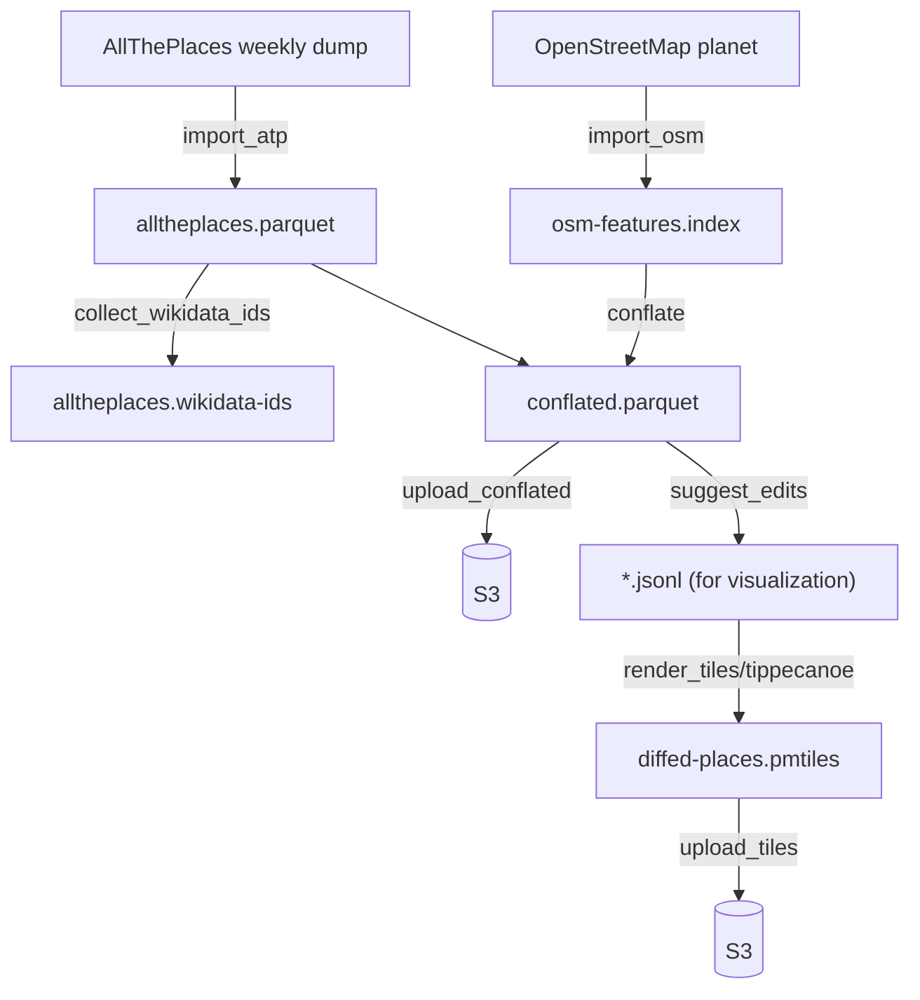

# Technical design: `osm-diffs`

Status: work in progress. This document describes the pipeline as it
exists today, not a target architecture — see the repository’s
[status badge](../README.md) and open issues for what’s still ahead
(in particular, nothing yet uploads suggested edits anywhere; see
“Status” at the end).

## Objective

Compute a weekly diff between [AllThePlaces](https://alltheplaces.xyz/)
(a large, open database combining point-of-interest scrapes with
Open Government Data) and
[OpenStreetMap](https://www.openstreetmap.org/about), and turn that
diff into edit suggestions that a human can review and, if correct,
apply to OpenStreetMap.

## Background

### Why OpenStreetMap needs this

OpenStreetMap's coverage of roads and administrative boundaries is
comprehensive. Points of interest are a different story: a shop,
restaurant, or other business only ends up on the map if a volunteer
happened to notice it and add it by hand — while most retail and
hospitality chains already publish exactly this information
themselves, as store locators and branch listings, because they want
customers to find them.

AllThePlaces exists to scrape that already-public data at scale, and
the OSM Foundation’s [Licensing Working
Group](https://osmfoundation.org/wiki/Licensing_Working_Group) has
[confirmed](https://osmfoundation.org/wiki/Licensing_Working_Group/Minutes/2023-08-14#Ticket%232023081110000064_%E2%80%94_First_party_websites_as_sources)
first-party websites as an acceptable data source for OSM.
In addition, AllThePlaces ingests various datasets, published under
clearly declared open-data licenses — municipal infrastructure,
government records, and more — so its scope reaches beyond retail
POIs, even though those still make up most of what it processes
today.

This project doesn’t apply bulk edits to OpenStreetMap, and has no
plans to: scraped data isn’t reliable enough to trust unreviewed, and
even if it were, bulk edits don’t fit how the OSM
community works — edits get proposed and reviewed by humans, not
pushed automatically by a script. What this project can do instead:
to find the delta between the two datasets systematically, for the
whole planet, within a week, and turn it into edit proposals for
volunteers to review — turning “maybe someone notices eventually” into
a
standing, repeatable check.

### What conflation is

“Conflation” is the general [GIS](https://en.wikipedia.org/wiki/Geographic_information_system)
term for combining two independently
produced geospatial datasets that describe overlapping real-world
features, so as to reconcile them into one better (or at least
cross-checked) result. It’s an old problem in GIS, going back to
combining paper maps and different survey sources long before
crowdsourced data existed; see the [OpenStreetMap wiki’s Conflation
page](https://wiki.openstreetmap.org/wiki/Conflation) for accessible
general background, including the tooling OSM’s own community already
uses for it (Hootenanny, JOSM’s Conflation plugin, Osmose). Matching
points of interest
specifically — deciding whether a point in one dataset and a point in
another dataset describe the same real-world place — is its own
well-studied sub-problem, surveyed in [Sun et al., “Conflating point of
interest (POI) data: A systematic review of matching
methods”](https://arxiv.org/abs/2310.15320) (2023). This pipeline’s
`conflate` step (below) is a POI-conflation implementation in that
sense, deliberately simple for now — see
[`src/matchers/`](../src/matchers/) for the actual matching logic, and
its own doc comments for what it does and doesn’t consider yet.

### OpenStreetMap’s data model, briefly

OpenStreetMap data is built from three element types: **nodes** (a
single point, the only element type that actually carries
latitude/longitude), **ways** (an ordered list of node references,
used for both lines and, when closed, area outlines), and
**relations** (a list of member elements — nodes, ways, or other
relations — with a role attached to each, used for anything that
doesn’t fit as a single way, from a multipolygon lake with islands to
a bus route). See the [OSM wiki’s “Elements”
page](https://wiki.openstreetmap.org/wiki/Elements) for the full
picture. The consequence that matters for this pipeline: a “place” in
OSM might be a node, or it might be a way or relation with no
coordinates of its own, only a shape built by resolving every member
down to its constituent nodes — this project has to construct real
geometry for all three cases, not just look up a point (see
`tables::feature_index` and `pipeline::osm::assemble` for how).

### What AllThePlaces does

AllThePlaces runs several thousand site-specific scrapers (“spiders”),
each written in Python against the [Scrapy](https://scrapy.org/)
framework — deliberately easy to write and contribute, which is a
large part of why the project has grown as far as it has. Most spiders
target one retail chain or brand's own store-locator page, but a
growing share instead pull from Open Government Data portals under
clear open licenses, so the combined dump isn't retail-only. It
publishes a combined weekly dump of every spider’s output as open data
(CC0), which several other projects already consume, including
OpenStreetMap-adjacent tooling and commercial mapping platforms. As
one (deliberately brief) indicator of how active the project is: as of
this writing, its
[repository](https://github.com/alltheplaces/alltheplaces) has around
16,000 commits, 800+ stars, and roughly 180 contributors.

### The OSM maintenance-tool ecosystem

Suggesting an edit is only useful if it reaches a human who can
actually review and apply it. A handful of established tools already
do this for different audiences, each with its own — unfortunately not
interchangeable — way of taking in machine-generated proposals:

- **[MapRoulette](https://maproulette.org/)** turns a batch of
  proposed changes (from an Overpass query or a GeoJSON file) into a
  “challenge”: a queue of small, independent tasks that volunteers
  work through one at a time, each reviewed and either applied or
  rejected by a human before anything touches OSM. Its audience skews
  toward “armchair mapping” — working from imagery and existing data,
  not necessarily visiting the place in person. This is the most
  direct fit for a system like this one: see its [challenge
  API](https://github.com/maproulette/maproulette-backend/blob/main/docs/challenge_api.md).
- **[Osmose](https://osmose.openstreetmap.fr/)** is a long-running
  (since 2008) quality-assurance tool: it runs its own analyzers over
  OSM data (and, for some checks, external open datasets) and surfaces
  the errors it finds for volunteers to fix. Third-party data can feed
  into it, but through writing a new analyzer plugin, not a simple
  upload endpoint — a heavier integration than MapRoulette’s.
- **[StreetComplete](https://wiki.openstreetmap.org/wiki/StreetComplete)**
  and **[Every Door](https://every-door.app/)** are mobile apps for
  surveying on the ground: StreetComplete generates its quests
  entirely from gaps it finds in OSM’s own current data (a missing tag
  on a pitch, a shop with no opening hours) and sends someone walking
  by to fill them in; Every Door is a general-purpose POI editor for
  the same on-the-ground audience. Neither currently accepts arbitrary
  externally-proposed edits the way MapRoulette does — they’re
  included here because they represent the *other* half of OSM’s
  editing audience (people checking things in person, not from a
  desk), which matters when deciding what kind of edit is worth
  proposing through which channel.

None of this is wired up yet (see “Status”): today’s outputs are
`conflated.parquet` (the raw match/no-match result; see
[`docs/outputs/CONFLATED_PARQUET.md`](outputs/CONFLATED_PARQUET.md))
and a [PMTiles](https://docs.protomaps.com/pmtiles/) archive for
visual review — not a submission to any of the above. Publishing
`conflated.parquet` itself is deliberate, not just a stopgap: how to
best turn a match into a human-reviewable edit proposal is still an
open question worth experimenting with, so the raw conflation result
is a public output in its own right — an intermediate milestone
toward this project’s actual goal, not just an internal implementation
detail.

## Technical design

### Pipeline overview

(`alltheplaces.wikidata-ids` has no outgoing edge above: nothing
consumes it yet, it’s generated on behalf of planned future work, see
[#682](https://github.com/alltheplaces/osm-diffs/issues/682).)

Every top-level step above is logged with its own wall-clock time and
memory snapshot, regardless of success or failure — see
[`docs/LOGGING.md`](LOGGING.md). Steps are meant to be memoized
against files already in `--workdir`, so re-running the pipeline in
the same directory skips whatever it already built (this also applies
below the step level, e.g. within `import_atp`/`import_osm`'s own
sub-stages) — though that memoization isn't fully reliable yet, see
[#704](https://github.com/alltheplaces/osm-diffs/issues/704).
`pipeline.log` itself is uploaded to S3 at the very end of a run no
matter how the run went (see
[`upload_logs`](../src/pipeline/upload.rs)), so a failed run’s log is
never lost.

### Pipeline steps

Timings below (where known) are wall-clock numbers from one real
full-planet run on production-representative hardware — a
deliberately memory-constrained Hetzner cpx22 (2 vCPU / 4 GB RAM) with
its working directory on an attached volume that peaked at ~174 GB
used (settling to ~148 GB once `import_osm` finished), not a dev
machine; see
[#665](https://github.com/alltheplaces/osm-diffs/issues/665) for the
full writeup. Nothing aggregates or dashboards these on an ongoing
basis, but every run's `pipeline.log` — with per-step timings for
that specific run — is uploaded to S3 alongside its output (see
`upload_logs` above), so up-to-date numbers are always one log fetch
away. Treat the ones below as one data point rather than a guarantee
— worth refreshing occasionally as the planet grows and the code
changes.

- **`import_atp`** ([`src/pipeline/atp/`](../src/pipeline/atp/)) —
  downloads AllThePlaces’ latest published run (`fetch.rs`) and parses
  every spider’s GeoJSON output out of the zip, in parallel, filtering
  out any dataset not usable for OSM by its declared license or an
  explicit `use:openstreetmap` marker (`is_usable_for_osm()` in
  [`src/pipeline/atp/mod.rs`](../src/pipeline/atp/mod.rs)), and writing
  the rest out as `alltheplaces.parquet`, sorted for spatial locality
  (see [`src/places/`](../src/places/)). **~3 minutes.**
- **`collect_wikidata_ids`**
  ([`src/pipeline/atp/wikidata_ids.rs`](../src/pipeline/atp/wikidata_ids.rs)) — extracts
  every `wikidata`/`brand:wikidata`/… tag value ATP carries, for a
  planned future feature (flagging OSM-only features whose brand ATP
  tracks elsewhere, [#682](https://github.com/alltheplaces/osm-diffs/issues/682));
  not consumed by anything yet. Not separately timed.
- **`import_osm`** ([`src/pipeline/osm/`](../src/pipeline/osm/)) —
  downloads the OpenStreetMap planet dump via BitTorrent (`fetch.rs`);
  does a first pass over it that decides, by tag, which nodes/ways/
  relations are even worth fully assembling, and which node
  coordinates and relation members they’ll need (`prune.rs`); builds
  real OGC geometry (point/line/polygon) for everything kept,
  resolving ways and relations down through their member nodes as
  OpenStreetMap’s data model requires (`assemble.rs`; see
  “Background” above); and writes the result into a memory-mapped
  spatial index (`OsmFeatureIndex`), queryable by S2 cell range
  without decoding every candidate (`index.rs`,
  [`src/tables/feature_index.rs`](../src/tables/feature_index.rs)).
  **~4h48m** for the whole step (dominated by the BitTorrent download,
  which varies with swarm health well beyond this project’s control;
  `OsmFeatureIndex::create` itself, the compute-heavy part, is only
  ~26 minutes of that).
- **`conflate`**
  ([`src/pipeline/conflate/mod.rs`](../src/pipeline/conflate/mod.rs))
  — a single scan over AllThePlaces (the smaller of the two datasets),
  in spatial order; for each feature, builds a search cap around its
  centroid and queries `OsmFeatureIndex` for OSM candidates inside it,
  scoring each (see [`src/matchers/`](../src/matchers/)) and keeping
  the best. Writes one row per ATP feature — matched or not — to
  `conflated.parquet`. See
  [`docs/outputs/CONFLATED_PARQUET.md`](outputs/CONFLATED_PARQUET.md)
  for that file’s schema. **~8 minutes** (~5 min matching, ~3 min
  writing) for 3.8M ATP features against the full planet.
- **`suggest_edits`** ([`src/pipeline/edits.rs`](../src/pipeline/edits.rs))
  — scans `conflated.parquet` for matched rows and asks an
  [`edit_suggesters`](../src/edit_suggesters/) implementation what
  should change, split into GeoJSON Lines layers by category (shops,
  infrastructure, trees). Not yet measured at full-planet scale.
- **`render_tiles`** ([`src/pipeline/tiles.rs`](../src/pipeline/tiles.rs))
  — runs [tippecanoe](https://github.com/felt/tippecanoe) over those
  layers to build one PMTiles archive for visual review. Not yet
  measured at full-planet scale.
- **`upload_conflated` / `upload_tiles` / `upload_logs`**
  ([`src/pipeline/upload.rs`](../src/pipeline/upload.rs)) — push the
  data output, the tiles, and the run’s own log to S3-compatible
  storage. Not yet measured at full-planet scale.

### Why `conflate` doesn’t need its own cache

`OsmFeatureIndex` is memory-mapped rather than backed by an explicit
decode cache. The reasoning: since `conflate` visits ATP in spatial
order, the OSM candidates it looks up tend to cluster the same way, so
the OS/CPU page cache keeps the relevant part of a planet-scale index
resident on its own, without this project having to build and tune a
cache of its own. That depends on how the hardware actually behaves,
so it wasn’t taken on faith — it was verified by running the pipeline
on production hardware, not just a development machine, since
page-cache behavior under real memory pressure and container limits
doesn’t reliably transfer from a laptop.

On the same [#665](https://github.com/alltheplaces/osm-diffs/issues/665)
run, peak RSS was 3.16–3.39 GiB on a 3.7 GiB box (cgroup accounting
agrees: ~3.5 GB) — and during `conflate.match` specifically, over 94%
of that was page-cache-backed (`rss_file_bytes`), not heap. That’s not
a hard ceiling the way heap-allocated memory would be: below it, the
kernel doesn’t crash, it just evicts and re-reads pages more often,
which shows up as slower wall-clock time, not an out-of-memory kill —
so it’s not moot even though the memory is “just” cache. A box with
meaningfully less RAM than the actively-touched working set erodes
exactly the speed benefit this design exists for.

### Code structure

Top-level modules (see [`src/lib.rs`](../src/lib.rs)):

| Module | Purpose |
|---|---|
| [`pipeline`](../src/pipeline/) | Orchestrates every step above, and owns their implementation: `pipeline::osm` (fetch/prune/assemble/index), `pipeline::conflate`, `pipeline::edits`, `pipeline::atp` (fetches and parses AllThePlaces’ data), plus pipeline-internal subsystems (`pipeline::provenance`, `pipeline::logging`, `pipeline::memstats`) that, despite the name, aren’t generic utilities — they’re only ever used from within `pipeline`. |
| [`tables`](../src/tables/) | On-disk, memory-mapped data structures shared across the pipeline (string pools, spatial indexes, external-sort-backed tables). |
| [`places`](../src/places/) | The `Place` type (an AllThePlaces feature) and its Parquet reader/writer. |
| [`matchers`](../src/matchers/) | Scores an OSM candidate against an ATP feature. |
| [`edit_suggesters`](../src/edit_suggesters/) | Decides what to actually change, for a matched pair. |
| [`geometry`](../src/geometry/) | Shared geometry-construction helpers (ring-building, polygon unions, S2 coverage stats, …). |
| [`utils`](../src/utils.rs) | Small, generic helpers genuinely shared by more than one otherwise-independent part of the crate. |

Related documentation:

- [`docs/TESTING.md`](TESTING.md) — how tests are organized and what
  CI enforces.
- [`docs/LOGGING.md`](LOGGING.md) — the JSON log format every pipeline
  step writes, and where weekly-run logs end up archived.
- [`docs/SUPPLY_CHAIN_SECURITY.md`](SUPPLY_CHAIN_SECURITY.md) — SBOM,
  build provenance, and the release process’s security properties.
- [`docs/outputs/`](outputs/) — the schema of files this pipeline
  produces for public consumption.

## Status

We wanted to get the pipeline running end to end before polishing any
single piece of it. As of this writing, it does: it produces
`conflated.parquet` and a PMTiles archive for visual review, each
uploaded to S3 at the end of a run. What’s still ahead follows from
that same choice — several pieces are deliberately simple placeholders
until the full pipeline was proven out:

- It does not yet run on an automatic weekly schedule in production.
- Nothing yet uploads suggested edits to any of the tools described
  above — that integration (most likely MapRoulette first, given its
  API is the closest fit) is future work, not yet designed in detail.
- The only matcher implemented, `PoiMatcher`, matches shop-category
  POIs solely on an exact `brand:wikidata` tag. We’d like to extend
  this well beyond it: matching stores by name too, not just
  `brand:wikidata`, and matching well beyond stores (a tree matcher
  conflating municipal tree datasets against OSM by spatial distance
  and species looks particularly tractable). See
  [#708](https://github.com/alltheplaces/osm-diffs/issues/708).
- `conflated.parquet` itself — every ATP feature, matched or not, not
  just what `suggest_edits` decided to propose — has no visualization
  of its own yet, which makes the matching step harder to review in
  isolation. See
  [#709](https://github.com/alltheplaces/osm-diffs/issues/709).
