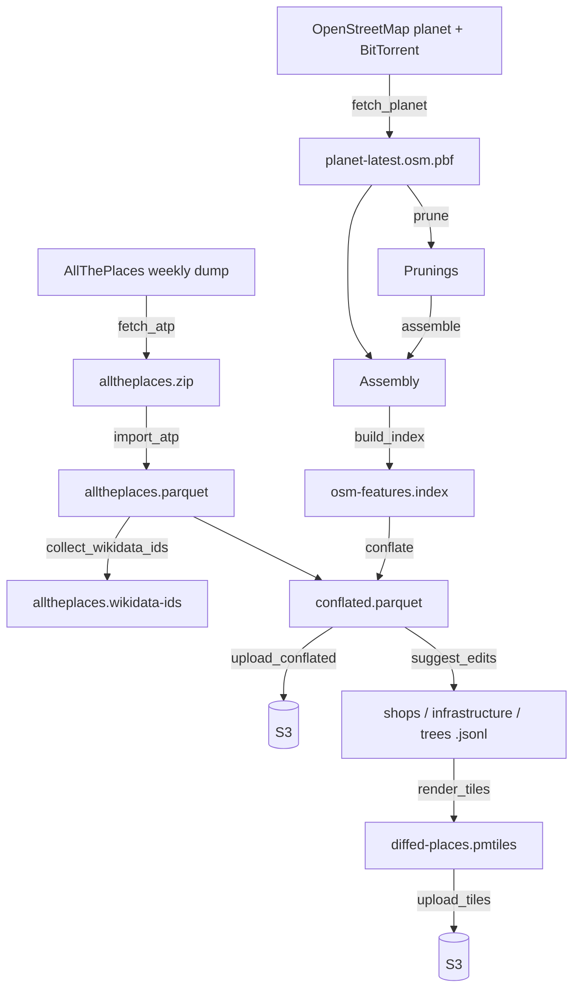

# Technical design: `osm-diffs`

Status: work in progress. This document describes the pipeline as it
exists today, not a target architecture — see the repository’s
[status badge](../README.md) and open issues for what’s still ahead
(in particular, nothing yet uploads suggested edits anywhere; see
“Status” at the end).

## Objective

Compute a weekly diff between [AllThePlaces](https://alltheplaces.xyz/)
(a large, open, crowdsourced database of point-of-interest scrapes) and
[OpenStreetMap](https://www.openstreetmap.org/about), and turn that
diff into edit suggestions that a human can review and, if correct,
apply to OpenStreetMap.

## Background

### Why OpenStreetMap needs this

OpenStreetMap is comprehensive for roads and administrative boundaries,
but point-of-interest (POI) coverage is uneven: a shop, restaurant, or
other business only ends up on the map if a volunteer happened to
notice it and add it by hand. Meanwhile, most retail and hospitality
chains already publish exactly this information on their own websites
— store locators, branch listings — because they need customers to
find them. AllThePlaces exists to scrape that already-public data at
scale; this project exists to compare it against what’s already in
OpenStreetMap and surface the difference, so volunteers spend their
time reviewing and confirming candidate edits instead of manually
re-discovering places that were already public knowledge somewhere
else.

### What conflation is

“Conflation” is the general GIS term for combining two independently
produced geospatial datasets that describe overlapping real-world
features, so as to reconcile them into one better (or at least
cross-checked) result. It’s an old problem in GIS, going back to
combining paper maps and different survey sources long before
crowdsourced data existed; see [GIS Geography’s introduction to
conflation](https://gisgeography.com/conflation-edgematching-rubbersheeting/)
for accessible general background. Matching points of interest
specifically — deciding whether a point in one dataset and a point in
another dataset describe the same real-world place — is its own
well-studied sub-problem, surveyed in [Sun et al., “Conflating point of
interest (POI) data: A systematic review of matching
methods”](https://arxiv.org/abs/2310.15320) (2023). This pipeline’s
`conflate` step (below) is a POI-conflation implementation in that
sense, deliberately simple for now — see
[`src/matchers/`](../src/matchers/) for the actual matching logic, and
its own doc comments for what it does and doesn’t consider yet.

### OpenStreetMap’s data model, briefly

OpenStreetMap data is built from three element types: **nodes** (a
single point, the only element type that actually carries
latitude/longitude), **ways** (an ordered list of node references,
used for both lines and, when closed, area outlines), and
**relations** (a list of member elements — nodes, ways, or other
relations — with a role attached to each, used for anything that
doesn’t fit as a single way, from a multipolygon lake with islands to
a bus route). See the [OSM wiki’s “Elements”
page](https://wiki.openstreetmap.org/wiki/Elements) for the full
picture. The consequence that matters for this pipeline: a “place” in
OSM might be a node, or it might be a way or relation with no
coordinates of its own, only a shape built by resolving every member
down to its constituent nodes — this project has to construct real
geometry for all three cases, not just look up a point (see
`tables::feature_index` and `pipeline::osm::assemble` for how).

### What AllThePlaces does

AllThePlaces runs several thousand site-specific scrapers (“spiders”),
one per retail chain or brand, each written in Python against the
[Scrapy](https://scrapy.org/) framework — deliberately easy to write
and contribute, which is a large part of why the project has grown as
far as it has. It publishes a combined weekly dump of every spider’s
output as open data (CC0), which several other projects already
consume, including OpenStreetMap-adjacent tooling and commercial
mapping platforms. As one (deliberately brief) indicator of how active
the project is: as of this writing, its
[repository](https://github.com/alltheplaces/alltheplaces) has around
16,000 commits, 800+ stars, and roughly 180 contributors.

### The OSM maintenance-tool ecosystem

Suggesting an edit is only useful if it reaches a human who can
actually review and apply it. A handful of established tools already
do this for different audiences, each with its own — unfortunately not
interchangeable — way of taking in machine-generated proposals:

- **[MapRoulette](https://maproulette.org/)** turns a batch of
  proposed changes (from an Overpass query or a GeoJSON file) into a
  “challenge”: a queue of small, independent tasks that volunteers
  work through one at a time, each reviewed and either applied or
  rejected by a human before anything touches OSM. Its audience skews
  toward “armchair mapping” — working from imagery and existing data,
  not necessarily visiting the place in person. This is the most
  direct fit for a system like this one: see its [challenge
  API](https://github.com/maproulette/maproulette-backend/blob/main/docs/challenge_api.md).
- **[Osmose](https://osmose.openstreetmap.fr/)** is a long-running
  (since 2008) quality-assurance tool: it runs its own analyzers over
  OSM data (and, for some checks, external open datasets) and surfaces
  the errors it finds for volunteers to fix. Third-party data can feed
  into it, but through writing a new analyzer plugin, not a simple
  upload endpoint — a heavier integration than MapRoulette’s.
- **[StreetComplete](https://wiki.openstreetmap.org/wiki/StreetComplete)**
  and **[Every Door](https://every-door.app/)** are mobile apps for
  surveying on the ground: StreetComplete generates its quests
  entirely from gaps it finds in OSM’s own current data (a missing tag
  on a pitch, a shop with no opening hours) and sends someone walking
  by to fill them in; Every Door is a general-purpose POI editor for
  the same on-the-ground audience. Neither currently accepts arbitrary
  externally-proposed edits the way MapRoulette does — they’re
  included here because they represent the *other* half of OSM’s
  editing audience (people checking things in person, not from a
  desk), which matters when deciding what kind of edit is worth
  proposing through which channel.

None of this is wired up yet (see “Status”): today’s output is a
[PMTiles](https://docs.protomaps.com/pmtiles/) archive for visual
review, not a submission to any of the above.

## Technical design

### Pipeline overview

Every top-level step is memoized against files already in `--workdir`
(re-running the pipeline skips whatever it already built), and every
step’s wall-clock time and memory snapshot is logged regardless of
success or failure — see
[`docs/LOGGING.md`](LOGGING.md). `pipeline.log` itself is uploaded to
S3 at the very end of a run no matter how the run went (see
[`upload_logs`](../src/pipeline/upload.rs)), so a failed run’s log is
never lost.

### Pipeline steps

- **`fetch_atp`** ([`src/atp/fetch.rs`](../src/atp/fetch.rs)) —
  downloads AllThePlaces’ latest published run.
- **`import_atp`** ([`src/atp/mod.rs`](../src/atp/mod.rs)) — parses
  every spider’s GeoJSON output out of the zip, in parallel, and
  writes it out as `alltheplaces.parquet`, sorted for spatial
  locality (see [`src/places/`](../src/places/)).
- **`collect_wikidata_ids`**
  ([`src/atp/wikidata_ids.rs`](../src/atp/wikidata_ids.rs)) — extracts
  every `wikidata`/`brand:wikidata`/… tag value ATP carries, for a
  planned future feature (flagging OSM-only features whose brand ATP
  tracks elsewhere, [#682](https://github.com/alltheplaces/osm-diffs/issues/682));
  not consumed by anything yet.
- **`fetch_planet`**
  ([`src/pipeline/osm/fetch.rs`](../src/pipeline/osm/fetch.rs)) —
  downloads the OpenStreetMap planet dump via BitTorrent.
- **`prune`** ([`src/pipeline/osm/prune.rs`](../src/pipeline/osm/prune.rs))
  — a first pass over the planet file that decides, by tag, which
  nodes/ways/relations are even worth fully assembling (and which
  node coordinates and relation members they’ll need), so the
  expensive step below doesn’t have to look at the whole planet.
- **`assemble`**
  ([`src/pipeline/osm/assemble.rs`](../src/pipeline/osm/assemble.rs))
  — builds real OGC geometry (point/line/polygon) for everything
  `prune` kept, resolving ways and relations down through their
  member nodes as OpenStreetMap’s data model requires (see
  “Background” above).
- **`build_index`**
  ([`src/pipeline/osm/index.rs`](../src/pipeline/osm/index.rs),
  [`src/tables/feature_index.rs`](../src/tables/feature_index.rs)) —
  writes the assembled features into a memory-mapped spatial index
  (`OsmFeatureIndex`), queryable by S2 cell range without decoding
  every candidate.
- **`conflate`**
  ([`src/pipeline/conflate/mod.rs`](../src/pipeline/conflate/mod.rs))
  — for every AllThePlaces feature, queries the OSM index for nearby
  candidates and scores them (see
  [`src/matchers/`](../src/matchers/)), writing one row per ATP
  feature — matched or not — to `conflated.parquet`. See
  [`docs/outputs/CONFLATED_PARQUET.md`](outputs/CONFLATED_PARQUET.md)
  for that file’s schema.
- **`suggest_edits`** ([`src/pipeline/edits.rs`](../src/pipeline/edits.rs))
  — scans `conflated.parquet` for matched rows and asks an
  [`edit_suggesters`](../src/edit_suggesters/) implementation what
  should change, split into GeoJSON Lines layers by category (shops,
  infrastructure, trees).
- **`render_tiles`** ([`src/pipeline/tiles.rs`](../src/pipeline/tiles.rs))
  — runs [tippecanoe](https://github.com/felt/tippecanoe) over those
  layers to build one PMTiles archive for visual review.
- **`upload_conflated` / `upload_tiles` / `upload_logs`**
  ([`src/pipeline/upload.rs`](../src/pipeline/upload.rs)) — push the
  data output, the tiles, and the run’s own log to S3-compatible
  storage.

### Code structure

Top-level modules (see [`src/lib.rs`](../src/lib.rs)):

| Module | Purpose |
|---|---|
| [`atp`](../src/atp/) | Fetches and parses AllThePlaces’ data. |
| [`pipeline`](../src/pipeline/) | Orchestrates the steps above; `pipeline::osm` is the OSM-side sub-pipeline (fetch/prune/assemble/index). |
| [`tables`](../src/tables/) | On-disk, memory-mapped data structures shared across the pipeline (string pools, spatial indexes, external-sort-backed tables). |
| [`places`](../src/places/) | The `Place` type (an AllThePlaces feature) and its Parquet reader/writer. |
| [`matchers`](../src/matchers/) | Scores an OSM candidate against an ATP feature. |
| [`edit_suggesters`](../src/edit_suggesters/) | Decides what to actually change, for a matched pair. |
| [`geometry`](../src/geometry/) | Shared geometry-construction helpers (ring-building, polygon unions, …). |
| [`provenance`](../src/provenance.rs) | Assembles `conflated.parquet`’s embedded CycloneDX provenance document. |
| [`logging`](../src/logging.rs), [`memstats`](../src/memstats.rs) | Structured JSON logging and per-step memory/cgroup snapshots. |
| [`s2_util`](../src/s2_util.rs), [`utils`](../src/utils.rs) | Small shared helpers. |

Related documentation:

- [`docs/TESTING.md`](TESTING.md) — how tests are organized and what
  CI enforces.
- [`docs/LOGGING.md`](LOGGING.md) — the JSON log format every pipeline
  step writes, and where weekly-run logs end up archived.
- [`docs/SUPPLY_CHAIN_SECURITY.md`](SUPPLY_CHAIN_SECURITY.md) — SBOM,
  build provenance, and the release process’s security properties.
- [`docs/outputs/`](outputs/) — the schema of files this pipeline
  produces for public consumption.

## Status

As of this writing: the pipeline runs end to end and produces
`conflated.parquet` and a PMTiles archive for visual review, each
uploaded to S3 at the end of a run. It does not yet run on an
automatic weekly schedule in production, and nothing yet uploads
suggested edits to any of the tools described above — that
integration (most likely MapRoulette first, given its API is the
closest fit) is future work, not yet designed in detail.
